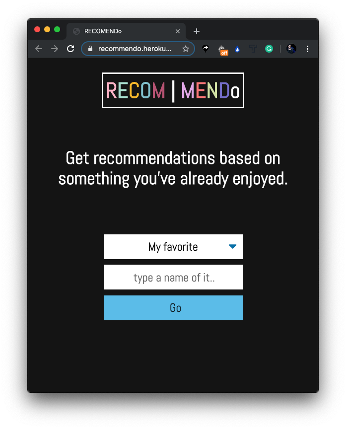
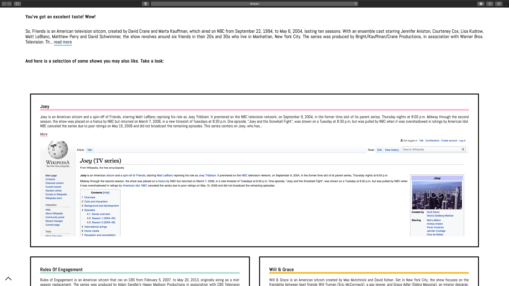

# Recommendo

_Recommendo_ is a simple, user-friendly app which can get you recomendations based on your favorite content (a favorite book, music band, tv show etc). 

It works well on any device.

Let's take a look:

In order to get a list of recommendations, you need to enter two search parametrs:
1. Select the type of the content,
2. Type the name of that content. 

If you click on **"My Favorite"**, a drop-down menu with the following content types will apear:

* band/artist;
* book
* movie
* tv Show:
* podcast:
* game;

Lets say, you want to get recommendations based on the tv show you just watched. In that case, you need to select _"tv show"_ and type the name of that tv show (_"Friends"_ for example).  

After that just click on **Go** and wait for your recommendations to get listed. 

Your personal recommendations will get displayed on the page with short annotation for every single content.  
If you would like to learn more about cirtain recommendation, you can click on _"More"_ and get the whole information from the **Wiki** page. 

Take a look at the desktop interface:

Ready to try the app out? Here is a [live page](https://recommendo.herokuapp.com/).
